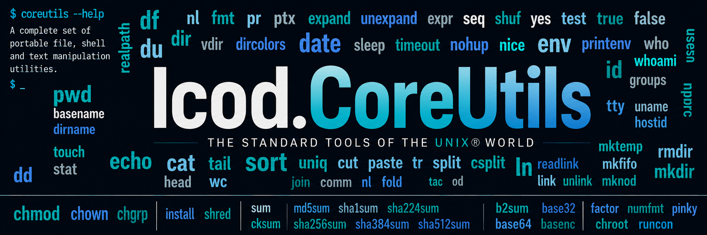

# Icod.CoreUtils



[](https://github.com/uniblab/Icod.CoreUtils/actions/workflows/pr-build-and-test.yaml)
[](https://github.com/uniblab/Icod.CoreUtils/actions/workflows/push-main.yaml)
[](https://github.com/uniblab/Icod.CoreUtils/actions/workflows/release.yaml)

A cross-platform, managed implementation of the GNU Coreutils/Fileutils/Textutils command family for **.NET 10**, written in **C# 13**.

`Icod.CoreUtils` brings familiar Unix command-line utilities to Windows, Linux, and macOS while preserving GNU-compatible command syntax and behavior wherever the underlying operating system permits it. The implementation is managed C# rather than a wrapper around installed GNU executables: ordinary command behavior is implemented by the repository itself.

The current suite contains **105 command projects**, available both as individual executables and through the `coreutils` multicall router.

> [!IMPORTANT]
> `Icod.CoreUtils` is an independent implementation and is not an official GNU or Free Software Foundation project. GNU Coreutils is used as the primary behavioral and command-line compatibility reference.

## Goals

The project aims to provide:

- familiar GNU Coreutils behavior, option syntax, diagnostics, output formats, and exit-status conventions;
- one maintained C# implementation that can run across Windows, Linux, and macOS;
- explicit handling of differences between POSIX and Windows filesystems, processes, terminals, security models, and path grammars;
- managed implementations of command behavior rather than delegating ordinary work to an installed host utility;
- reusable, independently testable command engines separated from their executable process hosts;
- deterministic and testable abstractions for paths, filesystems, terminal behavior, process interaction, cancellation, and standard streams;
- controlled diagnostics for genuinely unsupported operating-system facilities rather than silently pretending that another platform provides Unix capabilities it does not have;
- both traditional standalone command executables and a convenient single `coreutils` .NET tool router.

Compatibility is an ongoing engineering target rather than a claim that every operating system exposes identical facilities. Commands whose semantics depend on SELinux, POSIX ownership, special files, terminal descriptors, privilege boundaries, or other platform-specific facilities may necessarily differ in availability while retaining controlled and documented behavior.

## Current command suite

The `coreutils` router currently includes **105 command projects**:

<details>
<summary>Show all 105 commands</summary>

`arch`, `b2sum`, `base32`, `base64`, `basename`, `basenc`, `cat`, `chcon`, `chgrp`, `chmod`, `chown`, `chroot`, `cksum`, `comm`, `cp`, `csplit`, `cut`, `date`, `dd`, `df`, `dir`, `dircolors`, `dirname`, `du`, `echo`, `env`, `expand`, `expr`, `factor`, `false`, `fmt`, `fold`, `groups`, `head`, `hostid`, `hostname`, `id`, `install`, `join`, `link`, `ln`, `logname`, `ls`, `md5sum`, `mkdir`, `mkfifo`, `mknod`, `mktemp`, `mv`, `nice`, `nl`, `nohup`, `nproc`, `numfmt`, `od`, `paste`, `pathchk`, `pinky`, `pr`, `printenv`, `printf`, `ptx`, `pwd`, `readlink`, `realpath`, `rm`, `rmdir`, `runcon`, `seq`, `sha1sum`, `sha224sum`, `sha256sum`, `sha384sum`, `sha512sum`, `shred`, `shuf`, `sleep`, `sort`, `split`, `stat`, `stdbuf`, `stty`, `sum`, `sync`, `tac`, `tail`, `tee`, `test`, `timeout`, `touch`, `tr`, `true`, `truncate`, `tsort`, `tty`, `uname`, `unexpand`, `uniq`, `unlink`, `users`, `vdir`, `wc`, `who`, `whoami`, `yes`

</details>

Each command remains a standalone executable project. The router simply provides an additional composition layer:

```text
coreutils COMMAND [OPTION]... [ARG]...
```

For example:

```text
coreutils ls -la
coreutils sha256sum README.md
coreutils sort input.txt
coreutils cp source.txt destination.txt
```

Run:

```text
coreutils COMMAND --help
```

for the selected utility's command-specific help.

## Compatibility baseline

The authoritative upstream baseline for the current CoreUtils command family is **GNU Coreutils 9.11**.

The repository maintains an explicit, non-floating upstream-version ledger. Completed behavior does not silently change merely because a newer upstream package becomes available. Deliberate compatibility rebases are recorded and reviewed.

Important specification authorities include:

| Authority | Baseline | Purpose |
| --- | --- | --- |
| GNU Coreutils | 9.11 | Primary Coreutils command behavior |
| GNU Gnulib | Coreutils 9.11 pinned revision | Shared GNU semantics used by applicable commands |
| POSIX | POSIX.1-2024 / Issue 8 | Standardized Unix utility and system behavior |
| net-tools `hostname` | 2.10 | Traditional Linux `hostname` compatibility profile |

The repository's `hostname` command intentionally follows the traditional Linux net-tools interface rather than treating that command as part of the GNU Coreutils specification.

See [Icod.CoreUtils-Upstream-Version-Ledger.md](Icod.CoreUtils-Upstream-Version-Ledger.md) for the authoritative per-command and per-batch specification pins.

## Supported platforms

The primary supported CI hosts are:

| Platform | CI | Release architecture |
| --- | --- | --- |
| Windows | `windows-latest` | x64, ARM64 |
| Linux | `ubuntu-latest` | x64, ARM64 |
| macOS | `macos-latest` | x64, ARM64 |

BSD portability is a best-effort project goal, but BSD is not currently part of the required CI matrix.

Platform support does **not** mean that every operating system exposes identical semantics. Commands requiring facilities that do not exist on the active host must report that limitation in a controlled manner rather than fabricate success.

## Requirements

To build the repository:

- .NET 10 SDK
- a Git client
- Windows, Linux, or macOS

The projects target:

```text
net10.0
```

and use:

```text
C# 13
```

Release archives are framework-dependent and require the .NET 10 runtime on the target machine.

## Running from source

### Multicall router

The simplest way to run a command from the source tree is through the router:

```text
dotnet run --project coreutils/Icod.CoreUtils.Router.csproj -- ls -la
```

or:

```text
dotnet run --project coreutils/Icod.CoreUtils.Router.csproj -- sha256sum README.md
```

### Individual command projects

Every retained command also has its own executable project:

```text
dotnet run --project cat/Icod.CoreUtils.Cat.csproj -- README.md
```

```text
dotnet run --project ls/Icod.CoreUtils.Ls.csproj -- -la
```

```text
dotnet run --project sha256sum/Icod.CoreUtils.Sha256Sum.csproj -- README.md
```

This standalone-project structure is intentional. The router is a convenience layer; it is not the implementation of the commands themselves.

## .NET tool router

`coreutils/Icod.CoreUtils.Router.csproj` is configured as a .NET tool package with:

```text
PackageId:       Icod.CoreUtils
ToolCommandName: coreutils
```

From a package source containing the package, install it with:

```text
dotnet tool install --global Icod.CoreUtils
```

Then invoke commands through:

```text
coreutils ls -la
coreutils cat file.txt
coreutils sha256sum file.bin
```

A locally packed package can likewise be installed from the repository's `artifacts` directory by adding that directory as a package source.

## Building, testing, and packaging

The repository includes equivalent build entry points for Windows and Unix-like hosts.

### Windows

```text
build.cmd
```

### Linux / macOS

```text
./build.sh
```

With no argument, the scripts perform the complete local pipeline:

```text
clean
restore
build
test
pack
validate
```

An individual stage can also be selected:

```text
build.cmd test
build.cmd pack
```

or:

```text
./build.sh test
./build.sh pack
```

The default script pipeline uses the `Debug` configuration and writes package artifacts to:

```text
artifacts/
```

### Manual build

The equivalent basic commands are:

```text
dotnet clean Icod.CoreUtils.sln -c Debug
dotnet restore Icod.CoreUtils.sln
dotnet build Icod.CoreUtils.sln -c Debug --no-restore
dotnet test Icod.CoreUtils.sln -c Debug --no-build
```

Before release-oriented work, validate the `Release` configuration as well:

```text
dotnet clean Icod.CoreUtils.sln -c Release
dotnet restore Icod.CoreUtils.sln
dotnet build Icod.CoreUtils.sln -c Release --no-restore
dotnet test Icod.CoreUtils.sln -c Release --no-build
```

The repository defines three build configurations:

```text
Debug
Staging
Release
```

Release builds use the repository's stricter warning policy and treat compiler warnings as errors except for the currently exempted `CS1591` documentation warning.

## Continuous integration

Pull requests are validated in the `Staging` configuration on:

```text
windows-latest
ubuntu-latest
macos-latest
```

Pushes to `main` are validated in the `Release` configuration on the same three operating-system families.

The release workflow is separately triggered by SemVer-style `v*` tags. Release tags must identify commits contained in `main`, and the tag version must agree with both `<Version>` and `<PackageVersion>` in the `coreutils` router project.

Release validation covers:

```text
Windows x64
Windows ARM64
Linux x64
Linux ARM64
macOS x64
macOS ARM64
```

## Distribution model

The project supports two complementary distribution styles.

### `coreutils` router

The `Icod.CoreUtils` .NET tool package installs one `coreutils` command which dispatches directly to the corresponding managed command implementation:

```text
coreutils COMMAND [OPTION]... [ARG]...
```

The selected command retains ownership of its parsing, pathname interpretation, diagnostics, command semantics, and exit status.

### Standalone executables

The release pipeline is also designed to produce platform-specific archives containing the traditional individual command executables together with the `coreutils` router.

This allows users to choose between:

```text
coreutils ls -la
```

and the traditional form:

```text
ls -la
```

without maintaining separate command implementations.

## Architecture

`Icod.CoreUtils` is no longer the large incubation repository in which several neighboring Unix command suites once lived.

**Completion Gate G is complete.**

The repository now owns the GNU Coreutils/Fileutils/Textutils command family and its repository-local support code. Other command families and reusable mechanisms have been moved behind explicit repository and package boundaries.

### Command structure

The normal dependency direction is:

```text
published neutral package
        ↓
Icod.CoreUtils.Shared
        ↓
individual command project
        ↓
Program.cs executable composition root
```

Not every command requires every layer.

`Program.cs` owns attachment to the current operating-system process: arguments, standard streams, Ctrl+C or signal integration, and other process-global resources.

The command implementation owns command semantics: parsing, diagnostics, execution policy, output behavior, and exit status.

This separation allows command engines to be called directly by tests and other managed code without pretending that every invocation necessarily originates from a console process.

### `Icod.CoreUtils.Shared`

`Shared/Icod.CoreUtils.Shared.csproj` contains behavior genuinely shared by the Coreutils command family.

It is intentionally:

```text
repository-local
non-packable
```

It must not become an accidental cross-repository dependency.

Cross-suite mechanism belongs in neutral packages such as `Icod.CommandFramework`, `Icod.Path`, `Icod.Terminal`, and the other Icod foundation libraries.

## Extracted sibling suites

Several command families were originally developed inside this repository while the broader Unix-tool migration was being bootstrapped. They now have authoritative homes of their own:

| Suite | Repository | Examples |
| --- | --- | --- |
| Grep | [Icod.Grep](https://github.com/uniblab/Icod.Grep) | `grep` |
| Diffutils | [Icod.DiffUtils](https://github.com/uniblab/Icod.DiffUtils) | `cmp`, `diff`, `diff3`, `sdiff` |
| Tar | [Icod.Tar](https://github.com/uniblab/Icod.Tar) | `tar` |
| ProcPs | [Icod.ProcPs](https://github.com/uniblab/Icod.ProcPs) | procps-ng command family |
| Patch | [Icod.Patch](https://github.com/uniblab/Icod.Patch) | `patch` |
| Line Editor | [Icod.LineEditor](https://github.com/uniblab/Icod.LineEditor) | `ed`, `red`, `sed` |
| UtilLinux | [Icod.UtilLinux](https://github.com/uniblab/Icod.UtilLinux) | util-linux command family |

These suites must not be reintroduced into `Icod.CoreUtils` merely to share implementation code. Cross-repository reuse belongs behind a published neutral package or a public interoperability format.

For the full architecture record, see [Icod.CoreUtils-Architecture-and-Migration.md](Icod.CoreUtils-Architecture-and-Migration.md).

## Repository layout

At a high level:

```text
Icod.CoreUtils/
├── coreutils/          multicall router / .NET tool package
├── Shared/             repository-local Coreutils shared library
├── arch/               individual command project
├── cat/
├── cp/
├── ls/
├── ...
├── tests/              command and shared-library test projects
├── packaging/          distribution support
├── .github/            CI, release, and repository automation
├── Icod.CoreUtils.sln
├── build.cmd
├── build.sh
├── CONTRIBUTING.md
├── LICENSE
└── README.md
```

Each command directory normally contains its executable project, `Program.cs`, command implementation sources, and command-specific documentation.

## Pathname globbing policy

`Icod.CoreUtils` provides consistent in-process pathname globbing for appropriate filesystem operands through `Icod.CommandFramework`, rather than relying exclusively on the invoking shell to expand pathnames. This gives Class A and Class B utilities a defined cross-platform expansion model when wildcard-bearing operands reach the application unexpanded.

Globbing is **command- and operand-specific**. A utility must expand only operands whose semantic role is an eligible filesystem pathname. It must not blindly expand every argument merely because the argument contains wildcard characters. Destination names, names being created, lexical pathname text, expressions, data, and arguments belonging to a child command remain literal unless a tool explicitly defines otherwise.

For this CoreUtils policy, the pathname glob syntax is:

- `*` — matches zero or more characters within one pathname component; it does not consume a pathname separator.
- `?` — matches exactly one character within one pathname component; it does not consume a pathname separator.
- `**` — matches zero or more complete pathname components when, and only when, the complete component is exactly `**`. For example, `src/**/*.cs` is recursive, while an occurrence of `**` embedded inside another component does not acquire recursive meaning.

Recursive `**` expansion is pathname selection. It does not imply or enable a utility's own recursive operation. For example, expanding `rm **/*.tmp` produces explicit operands; it does not grant `rm` permission to recursively remove directories. Likewise, expanding a set of pathnames for `chmod` is distinct from `chmod -R`. Wildcards do not match a leading `.` unless the pattern names that period explicitly. Matching is ordinal case-insensitive on Windows and ordinal case-sensitive on other supported hosts.

Class A expansion preserves operand order and repetition. Explicitly named intermediate symbolic-link components may be followed where necessary to reach the named path, while wildcard-discovered symbolic-link directories are not recursively traversed by globbing. Globbing selects pathnames; it does not canonicalize literal operands.

The invoking shell may already have expanded an unquoted pattern before the utility starts. In that case the utility simply receives the resulting literal pathname operands. The policy in this section governs wildcard-bearing pathname operands that reach an `Icod.CoreUtils` application unexpanded.

For the Class A utilities below, an unmatched pattern is preserved as its original literal operand. Commands then apply their ordinary operand semantics to that literal. The conventional `-` operand is likewise preserved for commands that use it as a standard-input or standard-output sentinel.

### Class A utilities with in-process globbing

The following utilities implement the repository pathname-globbing policy for their eligible command-line pathname operands.

| Area | Utilities |
| --- | --- |
| File content and input | `cat`, `cut`, `expand`, `fmt`, `fold`, `head`, `nl`, `od`, `paste`, `pr`, `sort`, `tac`, `tail`, `unexpand`, `wc` |
| Checksums and hashes | `b2sum`, `cksum`, `md5sum`, `sha1sum`, `sha224sum`, `sha256sum`, `sha384sum`, `sha512sum`, `sum` |
| File inspection and reporting | `df`, `dir`, `du`, `ls`, `readlink`, `realpath`, `stat`, `vdir` |
| Copy, move, and install | `cp`, `install`, `mv` |
| Metadata mutation | `chcon`, `chgrp`, `chmod`, `chown` |
| Removal and destructive operations | `rm`, `rmdir`, `shred` |
| Other pathname operations | `sync`, `touch`, `truncate` |

Eligibility remains operand-specific even for utilities in this table. In particular, source collections may be expandable while destinations and other singular control operands remain literal. The following qualifications are part of the Class A contract:

- `cp`, `mv`, and ordinary file-copy forms of `install` expand source operands only. Destination operands and `--target-directory` values remain literal. `install -d` directory-creation operands remain literal because they name objects to be created.
- Option values such as `--reference=FILE` remain literal unless a command explicitly documents otherwise. Owner/group/mode/context specifications are not pathname patterns.
- `sort --files0-from`, `wc --files0-from`, and `du --files0-from` treat names read from those lists literally; command-line pathname operands remain independently eligible for expansion.
- `readlink` and `realpath` preserve the original spelling of non-pattern operands so that `Icod.Path` can interpret the intended pathname dialect. `realpath --relative-to` and `--relative-base` values remain literal.
- `**` selects explicit operands only. Command recursion such as `ls -R`, `chmod -R`, ownership recursion, `rm -r`, `rmdir --parents`, and `du` traversal remains controlled by each utility's own options and semantics.
- Old-style `od` offset/label operands are classified before pathname expansion, so only actual file operands are globbed.

### Class B utilities with slot-aware in-process globbing

Class B uses the same pathname syntax, leading-dot rule, platform case behavior, symbolic-link traversal policy, and literal-preservation rules as Class A, but it preserves the command's syntactic arity. A singular pathname slot is expanded independently: a literal operand remains literal, an unmatched pattern remains literal, exactly one match replaces the pattern, and more than one match is an error. Matches from one singular slot never spill into another argument position.

Some Class B commands are mode-aware. An argument position is eligible only when the command grammar has already identified it as an existing-path input. Data operands, destinations, names being created, symbolic-link payload text, and option values remain literal unless a command explicitly documents otherwise.

| Area | Utilities |
| --- | --- |
| Encoded-data input | `base32`, `base64`, `basenc` |
| Fixed-arity file comparison | `comm`, `join` |
| Splitting, filtering, indexing, and ordering | `csplit`, `split`, `uniq`, `ptx`, `shuf`, `tsort` |
| Link and name operations | `ln`, `link`, `unlink` |
| Configuration and accounting input | `dircolors`, `users`, `who` |

The following qualifications are part of the Class B contract:

- `base32`, `base64`, `basenc`, and `tsort` singular-expand their optional input `FILE`; `-` remains standard input.
- `comm` and `join` expand `FILE1` and `FILE2` independently. Each slot may resolve to exactly one pathname, but expansion never flattens the two slots into a shared operand list.
- `csplit` expands only its initial input `FILE`; every following `PATTERN` remains command-language syntax.
- `split` expands only its input `FILE`; output `PREFIX` remains literal. `uniq` likewise expands only `INPUT`; `OUTPUT` remains literal.
- `ptx` uses collection expansion for GNU-extension input operands. Traditional `[INPUT [OUTPUT]]` mode singular-expands `INPUT` and leaves `OUTPUT` literal. Break/ignore/only parameter-file option values remain literal.
- `shuf` singular-expands its positional `FILE` only in ordinary file mode. `--echo` operands are data, `--input-range` has no pathname operand, and `--output` and `--random-source` values remain literal.
- `ln` never expands symbolic-link targets. Hard-link sources use collection expansion only when the already-selected grammar targets a directory; otherwise the source is a singular slot. Destination names and target-directory operands remain literal.
- `link` singular-expands existing source `FILE1` while creation name `FILE2` remains literal. `unlink` singular-expands its one pathname and rejects multiple matches before attempting removal.
- `dircolors` and `users` singular-expand their optional input `FILE`. `who` singular-expands only the one-operand accounting-file form; the traditional two-operand form remains literal control syntax.

### Class C utilities with no internal pathname globbing

Class C utilities will **not** perform `Icod.CommandFramework` pathname expansion. This does not prevent an invoking shell from expanding a pattern before launching the utility; it means the utility itself will not reinterpret wildcard-bearing arguments as filesystem glob patterns.

| Area | Utilities |
| --- | --- |
| Host, process, environment, and identity information | `arch`, `groups`, `hostid`, `hostname`, `id`, `logname`, `nproc`, `pinky`, `printenv`, `pwd`, `tty`, `uname`, `whoami` |
| Numeric, data, and string operations | `echo`, `expr`, `factor`, `numfmt`, `printf`, `seq`, `sleep`, `tr`, `yes` |
| Pure status commands | `false`, `true` |
| Creation and template commands | `mkdir`, `mkfifo`, `mknod`, `mktemp` |
| Lexical and destination pathname grammars | `basename`, `dirname`, `pathchk`, `tee` |
| Singular control and option-file grammars | `chroot`, `date`, `stty` |
| Command wrappers and executors | `env`, `nice`, `nohup`, `runcon`, `stdbuf`, `timeout` |
| Special command grammars | `dd`, `test` |
| Multicall dispatcher | `coreutils` |

This exclusion is intentional. Creation-oriented utilities must preserve the names they are asked to create. Data- and expression-oriented utilities may legitimately receive `*`, `?`, or `**` as ordinary text. `basename` and `dirname` operate lexically on supplied pathname-shaped strings, while `pathchk` examines the pathname spelling itself. `tee` operands are output destinations. `chroot` keeps its process-root boundary explicit, and the path-valued arguments accepted by `date` and `stty` are option/control values rather than general input pathname operands. Wrapper utilities must pass the child command and its arguments through without reinterpreting them. `dd` and `test` have command grammars in which automatic argv expansion would alter the meaning of the command. The `coreutils` multicall dispatcher likewise leaves pathname policy to the selected utility rather than applying globbing itself.

The Class A, Class B, and Class C tables above define the pathname-expansion policy for the current command suite. New utilities or new operand forms must choose their pathname class explicitly rather than inheriting globbing merely because an argument happens to contain wildcard characters.

## Engineering documentation

The root of the repository contains the durable engineering records used during the compatibility, audit, and repository-migration work.

The most useful entry points are:

- [Icod.CoreUtils-Audit-and-Refactor-Roadmap.md](Icod.CoreUtils-Audit-and-Refactor-Roadmap.md) — detailed implementation, audit, and completion roadmap.
- [Icod.CoreUtils-Upstream-Version-Ledger.md](Icod.CoreUtils-Upstream-Version-Ledger.md) — authoritative upstream specification pins.
- [Icod.CoreUtils-Architecture-and-Migration.md](Icod.CoreUtils-Architecture-and-Migration.md) — final repository/package ownership and architecture after Completion Gate G.
- [Completion-Gate-G_Repository-Migration-Checklist-and-Roadmap.md](Completion-Gate-G_Repository-Migration-Checklist-and-Roadmap.md) — migration and extraction record.
- [Icod.CoreUtils-G10B-Dependency-Audit.md](Icod.CoreUtils-G10B-Dependency-Audit.md) — cross-repository dependency and isolation audit.
- [CONTRIBUTING.md](CONTRIBUTING.md) — contribution, implementation, testing, and style requirements.

The roadmaps deliberately distinguish implemented behavior, local validation, three-runner CI validation, platform-limited behavior, and deliberately deferred work.

## Contributing

Contributions are welcome.

Before making a substantive change, please read [CONTRIBUTING.md](CONTRIBUTING.md).

In particular:

- preserve GNU-compatible behavior unless an intentional divergence is documented;
- add focused automated tests for behavioral changes;
- preserve the command/`Program.cs` composition-root boundary;
- do not introduce source-tree dependencies on neighboring Icod repositories;
- do not delegate ordinary command behavior to the host GNU or Unix executable;
- use the repository's shared path, filesystem, command, process, and terminal abstractions rather than creating command-local substitutes;
- validate the complete solution before submitting a pull request;
- keep platform limitations explicit and controlled.

## License

The repository-level distribution and `coreutils` router are licensed under the **GNU General Public License, version 3 or later**.

See [LICENSE](LICENSE) for the full license text and consult individual project/file notices where additional licensing information applies.

The managed implementation is copyright © 2026 Timothy J. Bruce and contributors.

GNU, GNU Coreutils, GNU Gnulib, POSIX, Linux, Windows, macOS, and other names referenced by this project belong to their respective projects and owners. They are referenced for compatibility, interoperability, and specification purposes.

## Acknowledgements

This project exists because of the decades of work represented by GNU Coreutils, GNU Gnulib, POSIX, the Unix tradition, the .NET runtime and libraries, and the maintainers of the operating systems on which these tools run.

The objective of `Icod.CoreUtils` is not to hide those origins, but to preserve the familiar command-line contracts while making them available through a modern managed, cross-platform implementation.